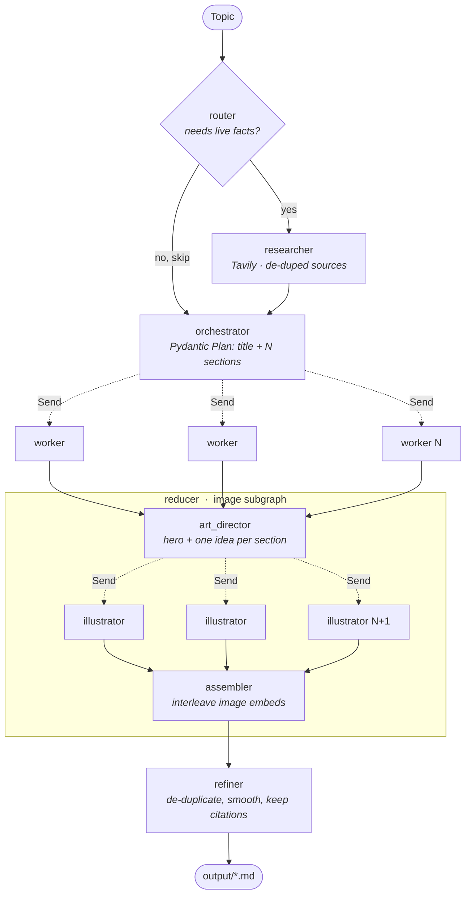

# Agentic Blog Generator

A multi-agent content pipeline built on **LangGraph**. Give it a topic; it decides whether the topic needs live web research, plans the sections, writes them **in parallel**, illustrates them, and polishes the result — then hands you publishable Markdown.

Not a prompt-chain wrapper. It's a stateful graph with conditional routing, map-reduce fan-out, and a nested subgraph.

## Architecture



Solid edges are ordinary edges; **dashed edges are `Send` fan-outs** — dynamic width, decided at runtime by how many sections the planner returned. Both fan-ins are implicit barriers: `art_director` and `refiner` don't fire until every parallel task ahead of them has finished.

## Why it's built this way

| Decision | Reason |
|---|---|
| **Conditional routing** at the entry point | A timeless explainer shouldn't pay for 12 web searches. The router reads the topic and picks a branch; the choice is state, so it's overridable and testable. |
| **`Send`-based fan-out** for sections | N sections write concurrently in one superstep instead of sequentially. Section count isn't known until the planner runs — graph width is dynamic. |
| **Custom state reducer** (`Annotated[List[str], operator.add]`) | Parallel writes to one key would otherwise clobber each other silently. This accumulates them, in dispatch order. |
| **Nested subgraph** for illustration | Image work has its own state, its own fan-out, and its own failure mode. It's invoked explicitly so its keys can't leak back into the parent's accumulator. |
| **Pydantic structured output** everywhere | Plans, routing decisions and image specs are typed objects, not parsed strings. No regex on LLM prose. |
| **Graceful degradation** | A failed image never kills a run — it renders a visible placeholder with the prompt that produced it. |

## Tech stack

| | |
|---|---|
| **Orchestration** | LangGraph 0.6 — `StateGraph`, conditional edges, `Send` fan-out, subgraphs, typed state with reducers |
| **LLM** | Google Gemini (`gemini-3.5-flash-lite` text, `gemini-3.1-flash-image` images) via `langchain-google-genai` |
| **Web research** | Tavily Search via `langchain-community` |
| **Schemas** | Pydantic v2 — `with_structured_output` for every non-prose LLM call |
| **Observability** | LangSmith — every node, LLM call and tool call traced; runs named and tagged by topic and settings |
| **UI** | Streamlit 1.50 — live per-node progress, tabbed output, verified with `AppTest` |
| **Config** | `python-dotenv`; the direct image REST call sends its key as a header, not a query param, so a failed request can't leak it into logs |

## Quickstart

```bash
python -m venv myenv && source myenv/bin/activate
pip install -r requirements.txt
```

Add a `.env` in the project root:

```
GOOGLE_API_KEY=...    # aistudio.google.com/apikey
TAVILY_API_KEY=...    # app.tavily.com

LANGSMITH_TRACING=true            # optional, omit to run untraced
LANGSMITH_API_KEY=...             # smith.langchain.com
LANGSMITH_PROJECT=blog-generator
LANGSMITH_ENDPOINT=https://api.smith.langchain.com
```

Run the GUI:

```bash
streamlit run app.py
```

Or use it as a library:

```python
from blog_pipeline import stream_blog

for namespace, node, payload in stream_blog("Global Warming", enable_images=False):
    print(node, payload and list(payload))
```

## Observability

Tracing is environment-driven — no instrumentation in the graph code. With the `LANGSMITH_*` vars set, every run appears in LangSmith as a tree: the parent graph, each node, the nested image subgraph, and every underlying Gemini and Tavily call with its own latency and token counts.

Runs are named `blog: <topic>` and tagged `images:on|off` and `research:auto|True|False`, so you can filter to one configuration and compare. Parallel workers show up as concurrent siblings, which is the quickest way to confirm the fan-out is actually running in parallel rather than sequentially.

The Streamlit sidebar shows whether tracing is live and links to the project.

## Layout

```
app.py              Streamlit GUI
blog_pipeline.py    the graph — importable, no notebook dependency
notebooks/
  blog_generator.ipynb                     orchestrator → workers → reducer
  blog_research_refinement.ipynb           + router, Tavily research, refiner
  blog_research_with_image_generation.ipynb + image subgraph
```

The notebooks are the build history, each one adding a capability to the last — useful for reading the design one layer at a time.

## Notes

Image generation calls `gemini-3.1-flash-image`, which has **no free-tier quota** — without billing enabled on the Google key, every image returns HTTP 429 and the blog renders placeholders. Text generation and research are unaffected. Toggle images off in the sidebar to skip the calls entirely.
